# Baskit

Offline-first Flutter product catalog app with Google SSO. Built for the Flutter assignment described in [docs/requirements.md](docs/requirements.md).

Data flow is strictly **API → Repository → Drift → GetX Controller → UI** — only the initial sync and explicit refresh call the network; every other screen reads from the local Drift database. See [docs/architecture.md](docs/architecture.md) for the full design and the diagram below for the high-level picture.

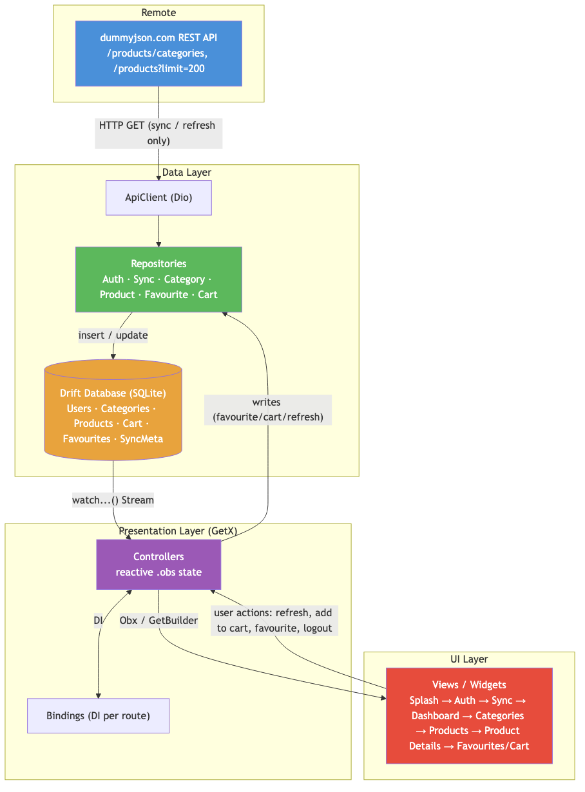

## App Flow

```
Splash → Google Login → Initial Data Sync → Dashboard → Categories → Products → Product Details
                                                              ↳ Favourites   ↳ Cart
```

## Tech Stack

| Concern | Package |
|---|---|
| State / DI / Routing | `get` (GetX) |
| Local database | `drift` + `drift_flutter` (SQLite) |
| Auth | `google_sign_in` |
| HTTP | `dio` |
| Connectivity | `connectivity_plus` |
| Images | `cached_network_image` |

## Features

- Google SSO login with persisted session (Drift `Users` table)
- Non-dismissible sync dialog downloading categories + products (`dummyjson.com`) on first login
- Dashboard: profile, category/product counts, last sync date, refresh, logout
- Categories grid → Products list (search, pull-to-refresh, sort by price/rating) → Product details (image carousel, add to favourite/cart)
- Favourites and Cart modules (quantity update, subtotal/discount/grand total), all Drift-backed
- Fully functional offline after the first sync
- Glassmorphism UI theme (see `.claude/skills/glassmorphism/`)

## Project Structure

```
lib/
├── app/            # routes, theme, bindings, Google auth config
├── data/
│   ├── local/       # Drift database, tables, DAOs
│   ├── remote/      # Dio client + dummyjson API
│   ├── models/      # DTOs
│   └── repositories/  # only layer allowed to call both API and Drift
├── modules/         # one folder per screen (binding/controller/view): splash, auth,
│                     # sync, dashboard, categories, products, product_details, favourites, cart
├── services/        # google_auth_service, connectivity_service
└── shared/          # reusable widgets, utils
```

Full breakdown: [docs/architecture.md](docs/architecture.md).

## Getting Started

```bash
flutter pub get
dart run build_runner build --delete-conflicting-outputs   # after any Drift table change
flutter run
```

**Google Sign-In setup** (see [lib/app/config/google_auth_config.dart](lib/app/config/google_auth_config.dart) for details): needs three OAuth client IDs from one Google Cloud project — Android (package + SHA-1), iOS (bundle ID), and Web (used as `webClientId`, required by both platforms). Android, iOS, and Web are all configured.

Commands: `flutter analyze` · `flutter test`

## Release Builds

Built locally and kept out of git (binaries) — see `.gitignore`. Rebuild with:

```bash
flutter build apk --release   # → build/app/outputs/flutter-apk/app-release.apk
flutter build ipa --release   # → build/ios/ipa/baskit.ipa
```

Copies for submission are in `release/` (gitignored, not pushed) and shared via Drive: **[baskit-release.apk / baskit-release.ipa](https://drive.google.com/drive/folders/1A2gs0XGslEbkFzOKiApB995XXAF4dRIh?usp=drive_link)**.

The IPA is signed for **App Store** distribution (automatic signing, team `8W9WP349VS`) — not an ad-hoc/development build, so it won't sideload directly onto a device; it's meant to be uploaded via Transporter/TestFlight, or re-exported ad-hoc if direct install is needed.

## Screenshots

| | | |
|---|---|---|
| 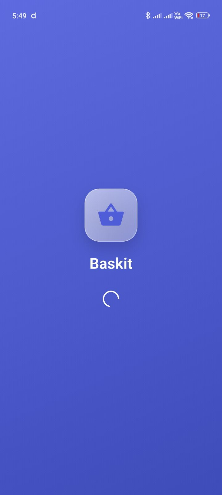<br>Splash | 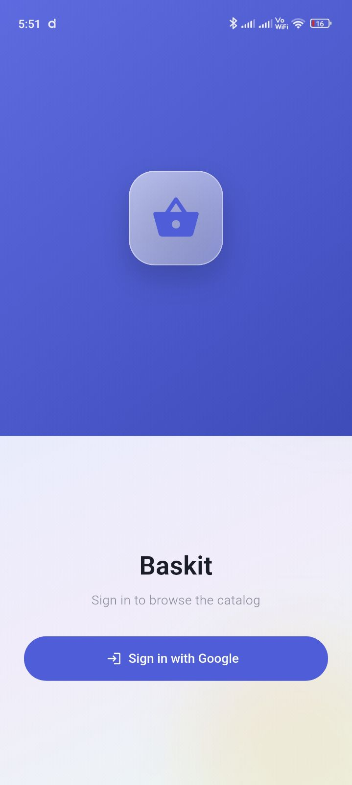<br>Google Login | 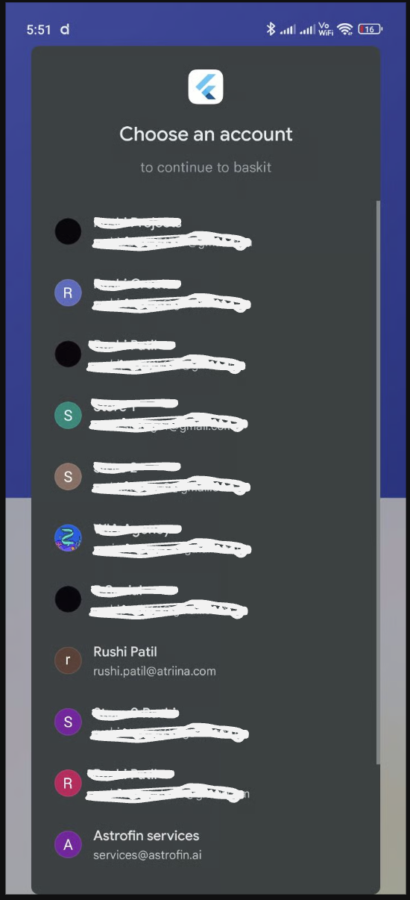<br>Account Picker |
| 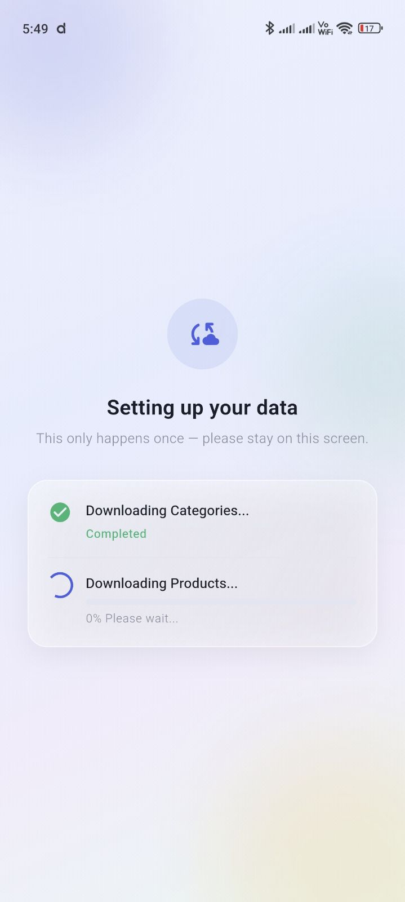<br>Initial Sync | 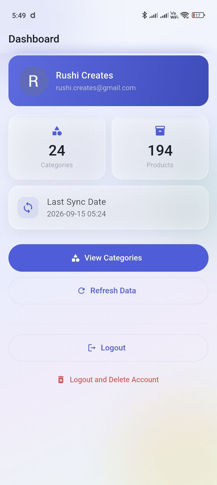<br>Dashboard | 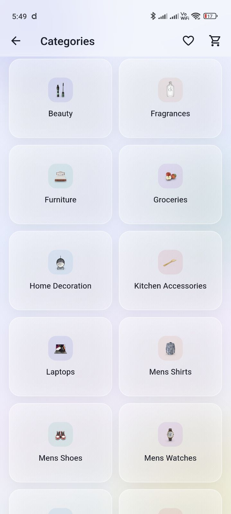<br>Categories |
| 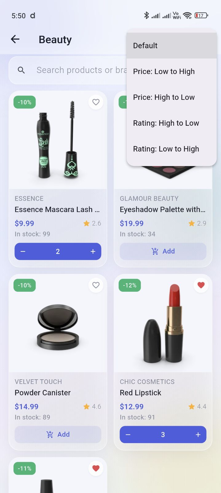<br>Products (search/sort) | 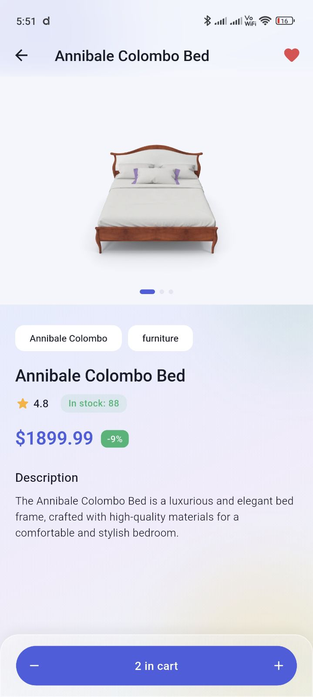<br>Product Details | 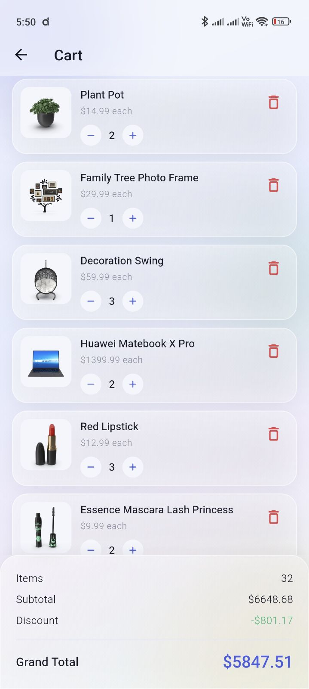<br>Cart |
| 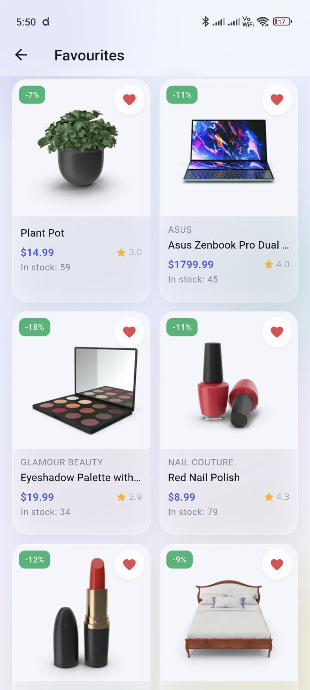<br>Favourites | 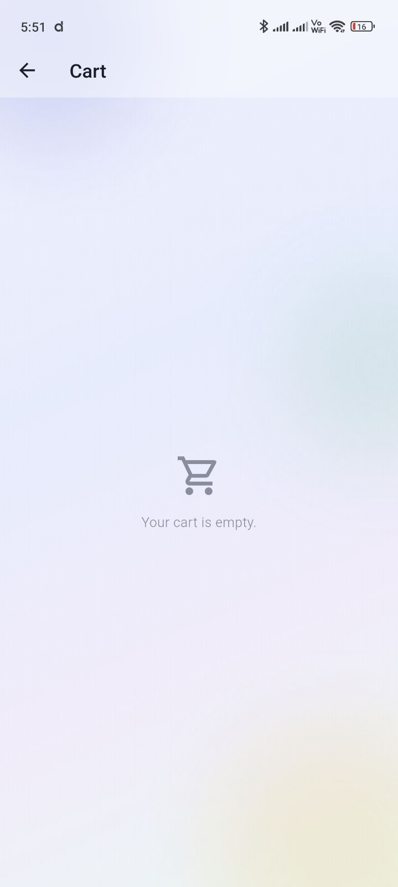<br>Empty Cart | 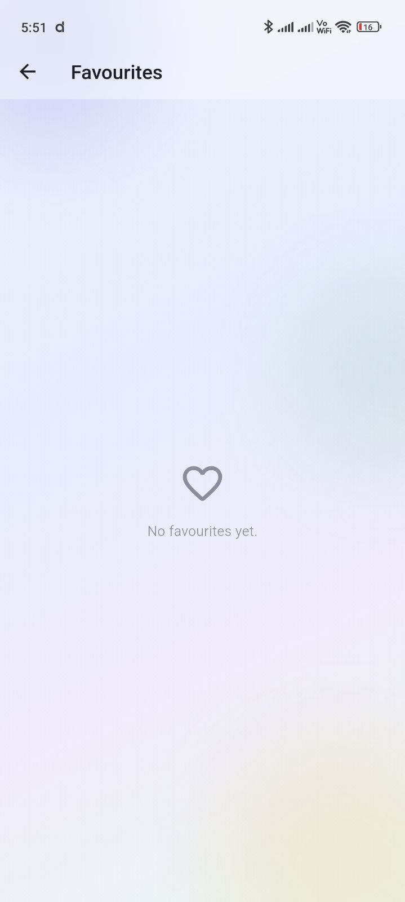<br>Empty Favourites |
| 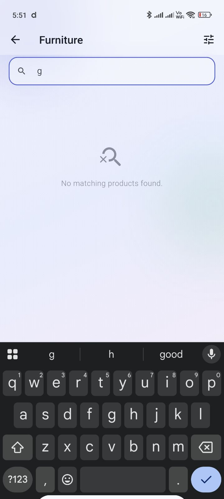<br>Empty Search Result | | |

## Submission Checklist

- [x] GitHub Repository
- [x] APK File and IPA File — `release/`
- [x] README.md — this file
- [x] Screenshots — `docs/screenshots/`
- [x] Architecture Diagram — `docs/architecture-diagram.png`
