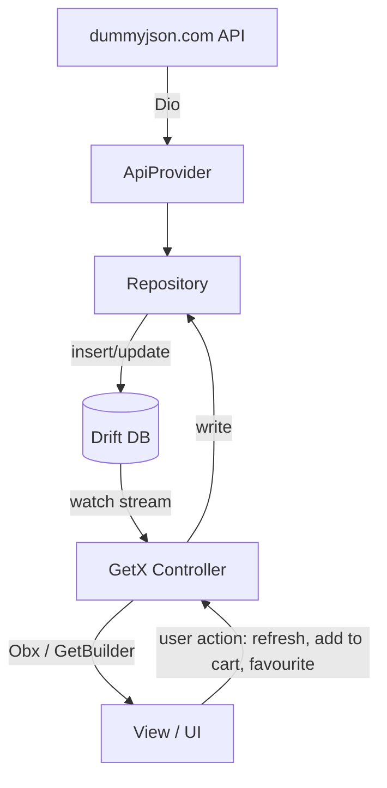

# Architecture — Baskit (Product Catalog App)

Source of truth for requirements: [requirements.md](./requirements.md). This document defines how those requirements map to code structure, state management, and data flow.

## 1. Layered Architecture (Mandatory Data Flow)

```
Remote API (dummyjson.com)
      ↓
ApiProvider (Dio/http client)
      ↓
Repository  ──writes──▶  Drift Database (SQLite)
                                 ↓ (watch/stream query)
                          GetX Controller (reactive state)
                                 ↓ (Obx / GetBuilder)
                                UI (Views/Widgets)
```

**Rule (non-negotiable per requirements §3):**
- Only the **Initial Sync** flow and explicit **Refresh** actions call the API.
- Every other screen reads exclusively from Drift via `watch...()` streams exposed by Repositories. Controllers never call `ApiProvider` directly except during sync/refresh.
- Repository is the only layer allowed to talk to both the API and Drift.

## 2. Folder Structure

```
lib/
├── main.dx.dart                # entry point, GetMaterialApp, initial bindings
├── app/
│   ├── routes/
│   │   ├── app_pages.dart      # GetPage list
│   │   └── app_routes.dart     # route name constants
│   ├── theme/
│   │   └── app_theme.dart
│   └── bindings/
│       └── initial_binding.dart  # global DI: Drift DB, Dio, GoogleSignIn
│
├── data/
│   ├── local/
│   │   ├── database.dart         # Drift @DriftDatabase
│   │   ├── database.g.dart       # generated (build_runner)
│   │   └── tables/
│   │       ├── users_table.dart
│   │       ├── categories_table.dart
│   │       ├── products_table.dart
│   │       ├── cart_table.dart
│   │       └── favourites_table.dart
│   ├── remote/
│   │   ├── api_client.dart       # Dio instance, base options, interceptors
│   │   └── dummyjson_api.dart    # getCategories(), getProducts()
│   ├── models/
│   │   ├── category_model.dart   # DTOs (fromJson) — mapped to Drift companions
│   │   └── product_model.dart
│   └── repositories/
│       ├── auth_repository.dart
│       ├── sync_repository.dart      # orchestrates initial download
│       ├── category_repository.dart
│       ├── product_repository.dart
│       ├── favourite_repository.dart
│       └── cart_repository.dart
│
├── modules/                       # one folder per screen, GetX convention
│   ├── splash/
│   │   ├── splash_binding.dart
│   │   ├── splash_controller.dart
│   │   └── splash_view.dart
│   ├── auth/                      # Google Login screen
│   │   ├── auth_binding.dart
│   │   ├── auth_controller.dart
│   │   └── auth_view.dart
│   ├── sync/                      # non-dismissible download dialog/screen
│   │   ├── sync_binding.dart
│   │   ├── sync_controller.dart
│   │   └── sync_view.dart
│   ├── dashboard/
│   │   ├── dashboard_binding.dart
│   │   ├── dashboard_controller.dart
│   │   └── dashboard_view.dart
│   ├── categories/
│   │   ├── categories_binding.dart
│   │   ├── categories_controller.dart
│   │   └── categories_view.dart
│   ├── products/                  # product list by category
│   │   ├── products_binding.dart
│   │   ├── products_controller.dart
│   │   └── products_view.dart
│   ├── product_details/
│   │   ├── product_details_binding.dart
│   │   ├── product_details_controller.dart
│   │   └── product_details_view.dart
│   ├── favourites/
│   │   ├── favourites_binding.dart
│   │   ├── favourites_controller.dart
│   │   └── favourites_view.dart
│   └── cart/
│       ├── cart_binding.dart
│       ├── cart_controller.dart
│       └── cart_view.dart
│
├── shared/
│   ├── widgets/                   # reusable widgets (product_card, rating_stars, etc.)
│   ├── utils/                     # formatters, connectivity checker
│   └── error/
│       └── app_error.dart         # typed error states used across controllers
│
└── services/
    ├── google_auth_service.dart   # wraps google_sign_in
    └── connectivity_service.dart  # wraps connectivity_plus

test/
├── data/
│   └── repositories/              # repository unit tests (mock ApiProvider + in-memory Drift)
└── modules/
    └── ...                        # controller tests
```

## 3. Tech Stack

| Concern | Package | Reason |
|---|---|---|
| State/DI/Routing | `get` (GetX) | Mandated |
| Local DB | `drift` + `sqlite3_flutter_libs` + `drift_dev` (build_runner) | Mandated |
| Auth | `google_sign_in` | Mandated |
| HTTP | `dio` | Interceptors, cleaner error handling than plain `http` |
| Connectivity | `connectivity_plus` | Detect offline state for error messaging |
| Images | `cached_network_image` | Product image carousels/lists, offline-friendly caching |
| Carousel | `carousel_slider` (or `PageView` — no extra dep) | Product Details image carousel |

## 4. Drift Schema (requirements §"Database Tables")

- **Users**: `googleId (PK)`, `name`, `email`, `photoUrl`, `lastLoginAt`
- **Categories**: `slug (PK)`, `name`, `url`
- **Products**: `id (PK)`, `title`, `description`, `brand`, `category` (FK→Categories.slug), `price`, `discountPercentage`, `rating`, `stock`, `thumbnail`, `imagesJson` (List\<String\> stored as JSON)
- **Favourites**: `productId (PK, FK→Products.id)`, `addedAt`
- **Cart**: `productId (PK, FK→Products.id)`, `quantity`, `addedAt`
- **SyncMeta** (not in requirements list but required by Dashboard's "Last Sync Date"): `key (PK)`, `lastSyncAt`, `categoriesCount`, `productsCount`

All Drift DAOs expose `Stream<List<T>> watchAll()` style queries so GetX controllers can subscribe reactively (`StreamSubscription` in `onInit`, or `.obs` bridged via `RxStream`).

## 5. Screen-by-Screen Data Flow

### Splash
- Check Drift `Users` table + persisted Google session → route to Dashboard (if logged in & synced), Sync (if logged in, not synced), or Auth (if not logged in).

### Auth (Google Login)
- `GoogleAuthService.signIn()` → on success, `AuthRepository.saveUser()` writes to Drift `Users` table → navigate to Sync.

### Sync (Initial Data Download — non-dismissible)
- `SyncController` calls `SyncRepository.syncAll()`:
  1. `GET /products/categories` → insert into `Categories` table → emit progress "Downloading Categories... ✔ Completed"
  2. `GET /products?limit=200` → batch insert into `Products` table → emit `%` progress "Downloading Products... 45% Please wait..."
  3. Write `SyncMeta.lastSyncAt`
- On completion → navigate to Dashboard. On failure → show retry (per Error Handling §"No Internet During Initial Sync" / "API Failure").

### Dashboard
- Reads: `AuthRepository.currentUser` (stream), `CategoryRepository.count()`, `ProductRepository.count()`, `SyncMeta.lastSyncAt` — all from Drift, no API calls.
- Actions: View Categories (nav), Refresh Data (re-runs `SyncRepository.syncAll()`), Logout (clears session + optionally clears Drift tables).

### Categories
- `CategoryRepository.watchAll()` → GridView/Chips. Tap → Products screen filtered by category slug.

### Products (by Category)
- `ProductRepository.watchByCategory(slug)` stream, combined in-controller with local search text (`.obs`) and sort option (price/rating) applied client-side over the Drift result — no re-querying API.
- Pull-to-refresh triggers `SyncRepository.syncAll()` (or a lighter `refreshProducts()`), not a direct screen-level API call, keeping the API-call boundary inside Repository.

### Product Details
- `ProductRepository.watchById(id)`.
- Add to Favourite → `FavouriteRepository.toggle(productId)`.
- Add to Cart → `CartRepository.addOrIncrement(productId)`.

### Favourites
- `FavouriteRepository.watchAll()` joined with Products.

### Cart
- `CartRepository.watchAll()` joined with Products; controller computes Subtotal/Discount/Grand Total reactively from the stream.

## 6. Error Handling Strategy (requirements §"Error Handling")

Central `AppError` sealed type (`NoInternet`, `ApiFailure`, `Empty`) surfaced via a `Rx<AppError?>` per controller, rendered by a shared `ErrorStateWidget` with a **Retry** callback wired back to the controller's fetch/sync method. Mapping:

| Scenario | Trigger | UI |
|---|---|---|
| No Internet during initial sync | `connectivity_plus` check before sync | "Internet connection required for setup." + Retry |
| API failure | Dio exception during sync/refresh | "Something went wrong." + Retry |
| No products | Drift query returns empty (no filters) | "No products available." |
| Search result empty | Drift query + search text returns empty | "No matching products found." |
| Empty cart | Cart stream empty | "Your cart is empty." |

## 7. Offline-First Guarantee

Verified by requirements' Offline Scenario: once `SyncMeta.lastSyncAt` is set, Splash never blocks on network — all reads come from Drift. Only user-initiated Refresh/Sync requires connectivity, and that check happens explicitly via `ConnectivityService` before hitting the API.

## 8. Diagram (Mermaid — also export a PNG/JPG for submission's required "Architecture Diagram")



Exported for submission as [docs/architecture-diagram.png](./architecture-diagram.png) (rendered via `@mermaid-js/mermaid-cli` from `docs/architecture-diagram.mmd`, kept alongside for future edits).
