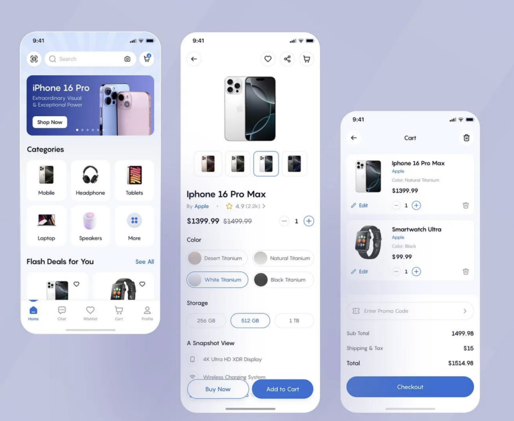

# Flutter Assignment: Product Catalog App 
# with Google SSO

## Technology Stack (Mandatory)

• GetX  
• Drift  
• Google Sign-In

## Application Flow

Splash Screen  
↓  
Google Login  
↓  
Initial Data Sync  
↓  
Dashboard  
↓  
Category List  
↓  
Product List  
↓  
Product Details

## 1. Authentication

### Google SSO Login

User should be able to:

• Login using Google  
• Persist login session  
• Logout

Store user information locally (Drift):

Google Id, Name, Email, Profile Image and Other Details

## 2. Initial Data Download (Mandatory)

After successful login:

### Show Non-Dismissible Download Dialog

Examples

Downloading Categories...  
✔ Completed

Downloading Products...  
45 % Please wait...

Download Data

### Categories

GET https://dummyjson.com/products/categories

### Products

GET https://dummyjson.com/products?limit=200

### Store Data

Save all downloaded data into Drift Database.

### Navigation

Sync Completed  
↓  
Dashboard

## 3. Offline-First Requirement / Every Time after successful 
## Download of Data

### Mandatory Architecture

API  
↓  
Drift Database  
↓  
GetX Controller  
↓  
UI

### Important

After initial sync:

Screens should load data from Drift

Screens should not call APIs directly

### Offline Scenario

Login Once  
↓  
Download Data  
↓  
Close App  
↓  
Internet Off  
↓  
App Should Continue Working

## 4. Dashboard

### Display:

User Profile  
Total Categories  
Total Products  
Last Sync Date

### Actions:

View Categories  
Refresh Data  
Logout

## 5. Categories Screen

Fetch categories from Drift.

### Display:

Beauty  
Furniture  
Fragrances  
Groceries  
Smartphones  
Laptops  
Etc.

### UI can use:

GridView  
ListView  
Chips

## 6. Products By Category

When a category is selected:

Show products belonging to that category.

### Display

Product Image  
Product Name  
Brand  
Category  
Price  
Rating  
Discount %  
Stock

### Features

• Search  
• Pull To Refresh  
• Sort by Price  
• Sort by Rating

## 7. Product Details Screen

### Display:

Images Carousel  
Title  
Description  
Brand  
Category  
Price  
Discount %  
Rating  
Stock

### Actions

Add To Favourite  
Add To Cart

## 8. Favourite Module

### Features:

Add Favourite  
Remove Favourite  
Favourite Listing

Store data using Drift.

## 9. Cart Module

### Features:

Add Product  
Update Quantity  
Delete Product

### Show:

Item Count  
Subtotal  
Discount  
Grand Total

Store data using Drift.

## Database Tables (Drift)

• Users  
• Categories  
• Products  
• Cart  
• Favourites

## Error Handling

Handle:

### No Internet During Initial Sync

Internet connection required for setup.

Retry

### API Failure

Something went wrong.

Retry

### No Products

No products available.

### Search Result Empty

No matching products found.

### Empty Cart

Your cart is empty.

## Submission Requirements

Candidate must provide:

1. GitHub Repository
2. APK File and IPA File
3. README.md
4. Screenshots
5. Architecture Diagram

## Reference Images :

